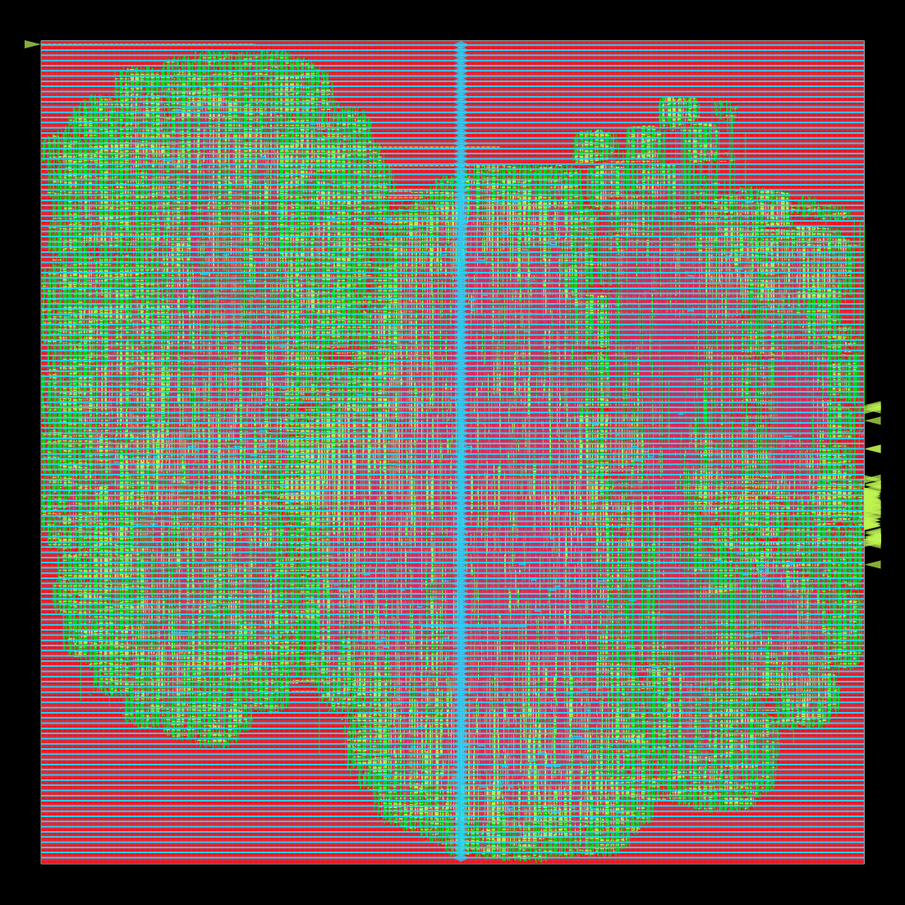

# SkyWater 130 nm (sky130hd) flow

RTL-to-GDS with [OpenROAD-flow-scripts](https://github.com/The-OpenROAD-Project/OpenROAD-flow-scripts) (ORFS) in its Docker image `openroad/orfs:latest`.

| Design | Top | What it is |
|---|---|---|
| `aes/` | `aes_core` | The AES-128 core by itself (Verilog produced by sv2v from `rtl/user_domain/aes/`) |
| `croc/` | `croc_soc` | The whole Croc SoC with the AES peripheral, core only (no IO pads) |

## Run

You need Docker. From the repository root:

```sh
docker pull openroad/orfs:latest
asic/sky130/run_orfs.sh aes      # AES core alone, about an hour on 4 cores
asic/sky130/run_orfs.sh croc     # whole SoC, about 7 hours on 4 cores, needs about 11 GB RAM
```

Outputs go to `asic/sky130/build/{logs,reports,results}/sky130hd/<design>/base/`. The GDS is `results/.../6_final.gds`, and the layout picture is `reports/.../final_all.webp.png`.

On an Apple Silicon Mac the image is x86 only, so Docker runs it under emulation. Turn on "Use Rosetta for x86/amd64 emulation" in Docker Desktop, and set `DOCKER_PLATFORM=linux/amd64` if Docker asks. Expect it to be several times slower than on an x86 machine.

## What changed for Sky130

Croc targets IHP 130 nm, so three IHP-specific pieces were replaced (Bender target `sky130`):

- `sky130/tc_clk.sv`: clock inverter, buffer, mux, xor and clock gate mapped to `sky130_fd_sc_hd` cells.
- `sky130/tc_sram_impl.sv`: the two 512x32 SRAM banks built from flip-flops. Same interface and one-cycle read latency as Croc expects. All Croc C tests that pass on the upstream memory model also pass with it in Verilator (`test_idma` hangs with both models, so it is an upstream test issue).
- `rtl/croc_chip.sv` (IHP IO pads) is left out; the top is `croc_soc`.

`sky130/tc_sram_impl_openram.sv` maps each bank onto an OpenRAM macro (`sky130_sram_1rw1r_64x256_8`) instead. It is not used yet: the macro's power pins are small met3 shapes that need a custom power grid.

`croc/files.mk` is generated from `Bender.yml` by `croc/gen_flist.sh`. Rerun it after adding RTL files.

## Results so far

### aes_core

| Metric | Value |
|---|---|
| Clock target | 50 MHz (20 ns) |
| Setup worst slack | +13.19 ns (so roughly 140 MHz is reachable) |
| Hold worst slack | +0.51 ns |
| Detail-route DRC violations | 0 |
| Antenna violations | 0 |
| Standard cells | 15,722 (269 flip-flops) |
| Cell area | 0.090 mm² |
| Die area | 0.217 mm² |
| Total power at 50 MHz | 37.5 mW |

Files: `aes/results/aes_core.gds.gz`, `aes/results/final_all.png`, `aes/results/6_finish.rpt`, `aes/results/6_report.json`.

### croc_soc



| Metric | Value |
|---|---|
| Clock target | 25 MHz (40 ns) on `clk_sys`, 10 MHz on JTAG |
| Setup worst slack | +17.59 ns (fmax about 44.6 MHz on `clk_sys`) |
| Hold worst slack | +0.096 ns |
| Detail-route DRC violations | 0 |
| Antenna violations | 0 (452 nets after routing, fixed by 6 diode-and-reroute passes, 1,567 diodes) |
| Max slew / max cap violations | 100 / 19 |
| Standard cells (no fill/tap) | 146,791 incl. 1,567 antenna diodes (37,443 flip-flops, most of them the 2 x 2 KiB flip-flop SRAM) |
| Cell area incl. tap cells | 1.86 mm² |
| Die area | 4.68 mm² (about 2.16 mm x 2.16 mm), 40 % utilization |
| Total power at 25 MHz | 81 mW |
| Runtime on 4 cores | about 7 h: detail routing about 2.5 h, antenna repair about 2.5 h |

Files: `croc/results/croc_soc.gds.gz`, `croc/results/final_all.png`, `croc/results/final_routing.png`, `croc/results/6_finish.rpt`, `croc/results/6_report.json`.

Antenna repair is a separate step, `scripts/repair_antennas_post_route.tcl`, which `run_orfs.sh croc` runs between detail routing and fill. It repeats diode insertion and incremental rerouting until `check_antennas` is clean, saving a checkpoint after each pass, so an interrupted run resumes where it stopped. ORFS's built-in version (`SKIP_ANTENNA_REPAIR_POST_DRT`, turned off in `croc/config.mk`) does the same inside the detail-route step, where an interruption loses the whole route. The slew and cap violations are on high-fanout nets and need a repair pass before tapeout.
